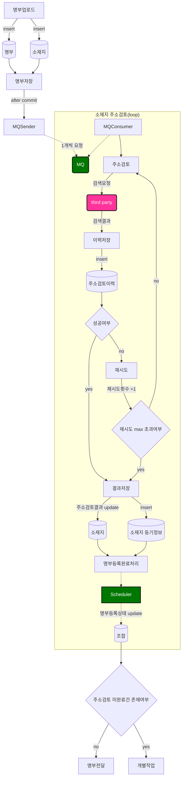
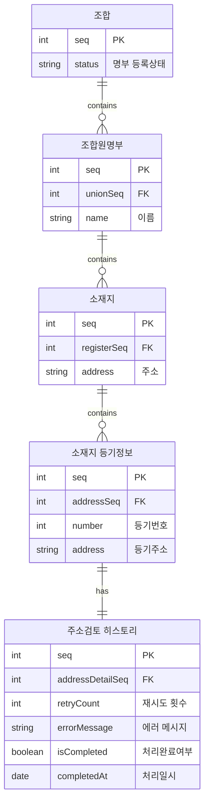

## 실무개선 Project
### 실무개선 Project 기대효과 분석
- 주소검토 실패건을 사람이 직접 처리하는 데 소요되는 N시간 이상의 리소스를 줄일 수 있다.
  - 주소검토시 실패건에 대해 담당자가 직접 단건으로 처리할 경우 개당 약 1분이 소요된다. 
- third party 이슈로 인한 주소검토 실패율을 낮출 수 있다.
  - 가끔 랜덤하게 실패가 발생하는 경우가 많았는데, 재시도 프로세스를 통해 시스템 에러를 줄일 수 있다.   
- 주소검토 이력관리를 통해 에러 트래킹의 용이성을 높일 수 있다. 
  - 재시도 횟수, 실패 사유 등에 대한 확인이 가능하다.
  - 필요하다면 이력관리 메뉴를 통해 담당자의 업무 편의를 높이거나, batch 로 실패건에 대한 후처리도 가능하다.
 
### 실무개선 Project 프로세스

  

### ERD
- 변경사항: 주소검토 히스토리 table 추가

